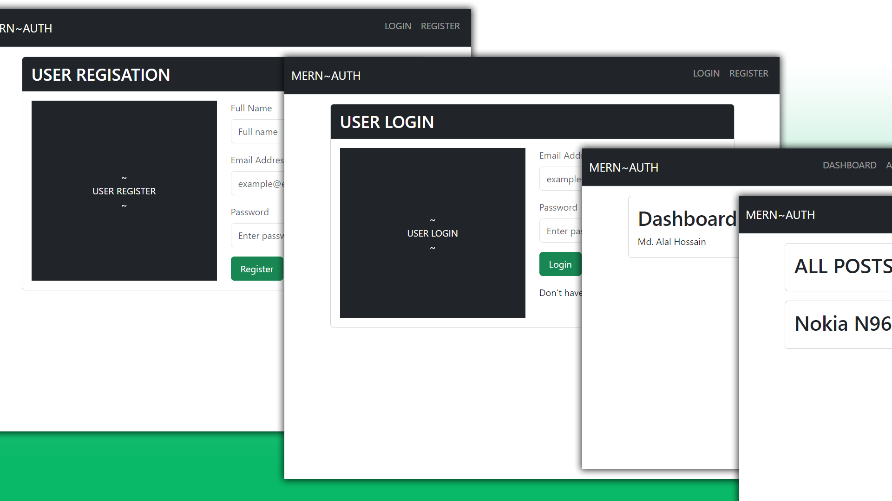

# MERN Stack Authentication

Welcome to the MERN stack application with authentication. This is for a SPA (Single Page Application) is built using the MERN (MongoDB, Express, React, Node.js) stack.



## Following functionalities: 
### Backend
- Backend API with Express and MongoDB (Mongoose)
- Routes for register, login, logout and post list
- JWT authentication (localStorage)
- Protected & public routes
- Custom error middleware

### Frontend
- React frontend to register, login, logout and view all post
- Bootstrap UI
- React Toastify notifications


 ## Getting Started
1. Clone this repository to your local machine:
git clone https://github.com/alalbd/mern-jwt-auth.git

2. Install the required dependencies for both the backend and frontend:
#### Backend:
Rename the .env.example file to .env and add the following
```
cd backend
npm install
```
Start the backend server:
```
npm start
```

#### Frontend:
```
cd frontend
npm install
```

Start the frontend server:
```
npm run dev
```

3. Access the application in your web browser at http://localhost:5173.


## Contributing

We welcome contributions from the community. If you'd like to contribute to this project, please feel free to open an issue or Make a PR.


## Acknowledgments

We would like to thank all contributors and the open-source community for their support.
